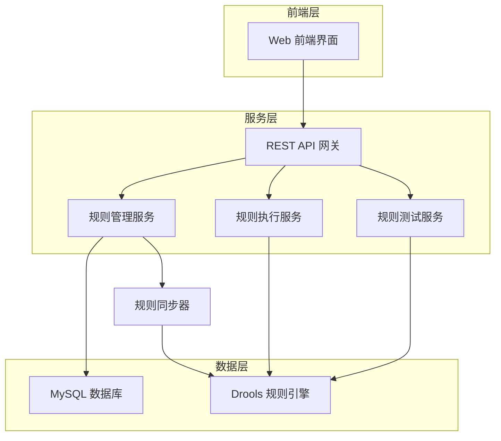

# 项目介绍

## 什么是 Drools 动态规则管理系统？

Drools 动态规则管理系统是一个基于 Drools 规则引擎的 Web 平台，旨在让业务用户能够通过直观的界面创建、编辑、测试和管理业务规则，而无需重启应用程序或依赖开发团队。

## 核心价值

### 🎯 业务敏捷性
- **即时生效**：规则修改后立即同步到运行时环境
- **零停机**：无需重启应用即可更新业务逻辑
- **快速响应**：业务需求变化时能够快速调整规则

### 👥 用户友好
- **可视化编辑**：提供专业的代码编辑器和语法高亮
- **实时验证**：编辑过程中实时检查语法错误
- **测试驱动**：支持自定义测试数据验证规则逻辑

### 🔧 技术先进
- **现代架构**：采用前后端分离的微服务架构
- **类型安全**：全栈 TypeScript 支持
- **高性能**：优化的数据库设计和缓存策略

## 适用场景

### 业务规则管理
- 促销活动规则配置
- 风险控制策略调整
- 审批流程规则定义
- 计费规则动态配置

### 决策支持系统
- 智能推荐算法规则
- 数据质量检查规则
- 业务指标计算规则
- 异常检测规则

### 合规性管理
- 监管规则实施
- 内控制度执行
- 数据安全策略
- 操作风险控制

## 系统架构

## 核心特性

### 🚀 动态规则管理
- 支持规则的 CRUD 操作
- 实时同步到 Drools 容器
- 规则版本控制和历史记录
- 规则状态管理（启用/禁用）

### 💻 专业代码编辑
- Monaco Editor 集成
- Drools DRL 语法高亮
- 智能代码提示和自动完成
- 实时语法验证和错误提示

### 🧪 规则测试功能
- 自定义测试数据输入
- 规则执行结果展示
- 测试历史记录
- 批量测试支持

### 📊 监控和分析
- 规则执行统计
- 性能监控指标
- 错误日志追踪
- 使用情况分析

## 目标用户

### 业务分析师
- 无需编程背景即可管理业务规则
- 通过可视化界面快速配置规则逻辑
- 实时测试和验证规则效果

### 系统管理员
- 监控规则执行状态和性能
- 管理规则版本和发布流程
- 维护系统稳定性和安全性

### 开发人员
- 通过 API 集成规则引擎功能
- 扩展和定制规则管理功能
- 优化系统性能和架构

## 下一步

准备好开始使用了吗？查看我们的[快速开始指南](./getting-started.md)来设置你的第一个规则管理环境。