# 规则测试

规则测试是确保业务逻辑正确性的重要环节。系统提供了完整的测试功能，支持自定义测试数据、实时执行和结果分析。

## 测试概述

### 测试流程

```mermaid
graph LR
    A[准备测试数据] --> B[选择规则]
    B --> C[执行测试]
    C --> D[查看结果]
    D --> E[分析输出]
    E --> F[保存测试用例]
```



## 创建测试用例

### 基本测试用例

在规则详情页面点击"创建测试"按钮，填写测试信息：

```typescript
interface TestCase {
  testName: string;          // 测试名称
  description?: string;      // 测试描述
  inputData: any;           // 输入数据
  expectedOutput?: any;     // 期望输出
  tags?: string[];          // 测试标签
}
```

### 输入数据格式

测试数据使用 JSON 格式，支持复杂的对象结构：

```json
{
  "facts": [
    {
      "type": "Customer",
      "data": {
        "id": 1001,
        "name": "张三",
        "age": 25,
        "vip": true,
        "registrationDate": "2025-01-01T00:00:00Z"
      }
    },
    {
      "type": "Order",
      "data": {
        "id": 2001,
        "customerId": 1001,
        "amount": 299.99,
        "status": "PENDING",
        "items": [
          {
            "productId": 101,
            "quantity": 2,
            "price": 149.99
          }
        ]
      }
    }
  ],
  "globals": {
    "discountRate": 0.1,
    "minOrderAmount": 100
  }
}
```

### 数据类型映射

系统会自动将 JSON 数据映射到 Java 对象：

```java
// Customer 类
public class Customer {
    private Long id;
    private String name;
    private Integer age;
    private Boolean vip;
    private LocalDateTime registrationDate;
    // getters and setters...
}

// Order 类
public class Order {
    private Long id;
    private Long customerId;
    private BigDecimal amount;
    private String status;
    private List<OrderItem> items;
    // getters and setters...
}
```

## 执行测试

### 单次执行

点击"执行测试"按钮，系统会：

1. **数据准备**：将 JSON 数据转换为 Java 对象
2. **规则加载**：加载指定的规则到 Drools 会话
3. **事实插入**：将测试数据插入工作内存
4. **规则执行**：触发规则引擎执行
5. **结果收集**：收集执行结果和日志

### 执行配置

可以配置测试执行参数：

```typescript
interface TestExecutionConfig {
  timeout: number;           // 超时时间（毫秒）
  maxMemory: number;        // 最大内存使用（MB）
  enableLogging: boolean;   // 是否启用日志
  logLevel: 'DEBUG' | 'INFO' | 'WARN' | 'ERROR';
  collectMetrics: boolean;  // 是否收集性能指标
}
```

## 测试结果分析

### 执行结果

测试执行完成后，系统会显示详细的结果信息：

```typescript
interface TestResult {
  testId: string;
  status: 'PASSED' | 'FAILED' | 'ERROR';
  executionTime: number;    // 执行时间（毫秒）
  memoryUsage: number;      // 内存使用（MB）
  rulesTriggered: string[]; // 触发的规则列表
  factsModified: any[];     // 修改的事实对象
  output: any;              // 输出结果
  logs: LogEntry[];         // 执行日志
  errors?: ErrorInfo[];     // 错误信息
}
```

## 下一步

掌握了规则测试功能后，你可以：
- 🔧 查看[开发指南](./development.md)了解如何扩展功能